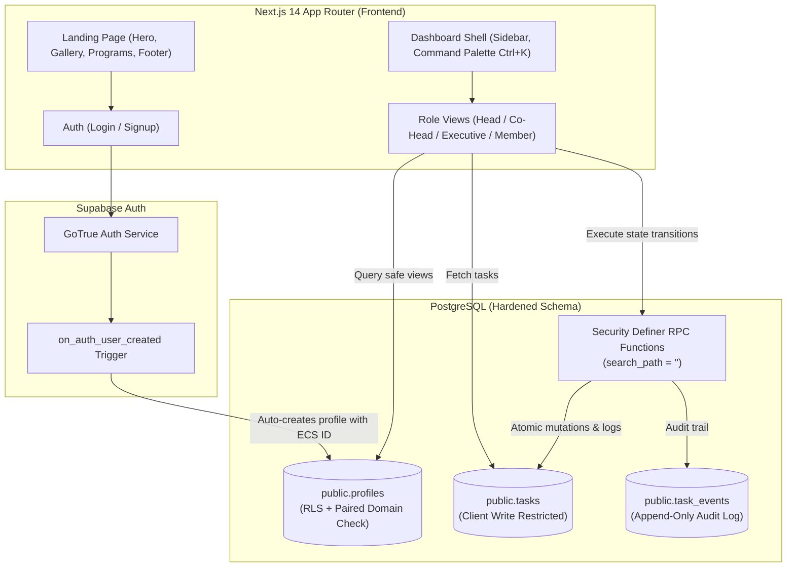

# E-Cell SMVIT — Platform & Member Management System

[](https://nextjs.org/)
[](https://www.typescriptlang.org/)
[](https://supabase.com/)
[](https://tailwindcss.com/)
[](https://www.postgresql.org/)

A full-stack redesign and operational platform built for the **Entrepreneurship Cell (E-Cell SMVIT)**. The project bridges a public landing page with an enterprise-grade member dashboard featuring domain hierarchies, a 4-tier Role-Based Access Control (RBAC) model, automated task lifecycle state machines, and real-time team management.

---

## 📑 Table of Contents

- [Key Technical Highlights](#-key-technical-highlights)
- [System Architecture](#-system-architecture)
- [Role Hierarchy & Access Control](#-role-hierarchy--access-control)
- [Database Security & Engineering](#-database-security--engineering)
- [Feature Showcase](#-feature-showcase)
- [Repository Structure](#-repository-structure)
- [Getting Started](#-getting-started)
- [Database Migrations & Test Suite](#-database-migrations--test-suite)
- [RPC API Reference](#-rpc-api-reference)

---

## 🚀 Key Technical Highlights

- **4-Tier RBAC & Domain Structure:** Custom multi-tenant organization across 6 domains (`tech`, `marketing`, `design`, `content`, `events`, `operations`) with strict hierarchical authority.
- **Search & Add Members by Name:** Domain Heads can discover unassigned candidates via real-time debounced name search (case-insensitive substring/prefix matching) or browse recent signups and assign them as Executives or Co-Heads with 1 click.
- **Strict Task Lifecycle State Machine:** Finite status transitions (`todo` → `in_progress` → `submitted` → `approved` / `changes_requested`) governed by database-enforced RPCs, preventing client-side tampering.
- **Enterprise-Grade Database Security:**
  - Row Level Security (RLS) policies protecting member PII (emails and USNs).
  - Column-level `INSERT` grants preventing spoofing of review metadata or status.
  - Security Definer RPCs hardened with `search_path = ''` to prevent search-path hijacking attacks.
  - Revoked client `UPDATE` and `DELETE` on operational tables; all transitions are atomic and audited in `task_events`.
- **Self-Contained SQL Security Test Harness:** Automated test suite (`supabase/test-roles-security.sql`) executing 60+ assertions inside an atomic `BEGIN ... ROLLBACK` transaction verifying security boundaries without polluting production data.
- **Modern UI & Design System:**
  - Dark/Light mode theme system with role-specific color accents.
  - Accessible tables with auto-collapsing card views on viewports `< 640px`.
  - Global Command Palette (`Ctrl+K`) for keyboard-first navigation.
  - Fluid animations via GSAP, Framer Motion, and Componentry canvas/WebGL components.

---

## 🏛 System Architecture



---

## 👥 Role Hierarchy & Access Control

| Role | Rank | Jurisdiction & Capabilities |
|---|:---:|---|
| **Head** | 3 | **Domain Leader:** Full jurisdiction over their domain. Can search unassigned members by name, assign them as Executive/Co-Head, modify subordinate roles, remove members, create tasks, and review all submissions. |
| **Co-Head** | 2 | **Senior Reviewer:** Domain senior. Can create tasks for Executives, execute personally assigned tasks, and review Executive submissions with approval/rejection notes. |
| **Executive** | 1 | **Contributor:** Executes assigned tasks, transitions tasks to `in_progress`, and submits deliverables with secure HTTPS verification links. |
| **Member** | 0 | **General / Unassigned:** Default state upon registration (`domain = NULL, designation = NULL`). Views member founder checklist until placed into a domain team by a domain Head. |

---

## 🛡 Database Security & Engineering

### 1. Paired Nullable Check Constraint
Members are either entirely unassigned or strictly paired to both a domain and designation.
```sql
CONSTRAINT profiles_domain_designation_paired_check
  CHECK (
    (domain IS NULL AND designation IS NULL) OR
    (domain IS NOT NULL AND designation IS NOT NULL)
  )
```

### 2. PII Protection via Seniority RLS & Safe Directory
- Subordinates cannot directly query senior profiles, preventing exposure of leaders' private `email` and college `usn`.
- The `team_directory()` RPC returns sanitized public data (`id, full_name, domain, designation`) so assigners and reviewers can be rendered safely.

### 3. Column-Level Privilege Restrictions
Direct client `INSERT` on `tasks` is locked down to safe operational fields:
```sql
GRANT INSERT (title, description, assigned_to, assigned_by, domain, priority, due_date)
  ON public.tasks TO authenticated;
```
Columns such as `id`, `status`, `submission_note`, `submission_link`, `review_note`, and `reviewed_by` **cannot** be passed by client inserts, completely neutralizing fabricated metadata attacks.

### 4. Zero Direct Client Mutations
- Direct `UPDATE` and `DELETE` on `tasks` and `task_events` are strictly **revoked** for `authenticated` users.
- State updates occur strictly through vetted, atomic PostgreSQL RPC procedures using `SELECT ... FOR UPDATE` row locks.

---

## 🎨 Feature Showcase

### 1. Instant Member Discovery & Team Placement
- **Live Debounced Name Search:** Domain Heads can type any member's name (e.g. *"Aditya"*, *"Kashyap"*) to query unassigned candidates instantly.
- **Candidate Roster Cards:** Candidates display initials avatar, full name, generated `ECS-2026-XXXXXX` Member ID, individual role selector (`Executive` or `Co-Head`), and a 1-click **Add to Team** action.
- **Available Unassigned Drawer:** Heads can toggle a drawer showing all unassigned signups awaiting domain placement.

### 2. Task Execution Workflow
```
[ To Do ] ──(start_task)──> [ In Progress ] ──(submit_task)──> [ Submitted ]
                                   ▲                                 │
                                   │                           (review_task)
                                   │                                 │
                           [ Changes Requested ] <───────────────────┴──> [ Approved ]
```
- Every transition logs actor ID, action name, timestamp, and optional notes to `task_events`.

### 3. Domain Analytics & Team Performance
- **Live Completion Rates:** Dynamic calculation of subordinate completion rates (`(approved / total) * 100`).
- **Overdue Detection:** Strict UTC date-only comparison (`due_date < CURRENT_DATE` and `status != 'approved'`).
- **Zero-Task Subordinate Handling:** Subordinates with 0 tasks are cleanly included with 0% metrics without division-by-zero errors.

### 4. Command Palette (`Ctrl+K`)
- Omnibox navigation across tasks, pages, and teammates.
- Real-time task filtering by title and status with direct navigation to review queues.

---

## 📂 Repository Structure

```
ecell-smvit/
├── app/                              # Next.js 14 App Router routes
│   ├── layout.tsx                    # Root layout with fonts, theme & auth providers
│   ├── page.tsx                      # Landing page (hero, about, gallery, programs, footer)
│   ├── login/page.tsx                # Supabase authentication login
│   ├── signup/page.tsx               # Member onboarding registration
│   └── dashboard/                    # Role-aware dashboard
│       ├── page.tsx                  # Main role view (Head, Co-Head, Exec, Member)
│       ├── team/page.tsx             # Domain team analytics & member management
│       ├── review/page.tsx           # Submissions review queue (Senior only)
│       └── assign/page.tsx           # New task assignment (Senior only)
├── components/
│   ├── auth-provider.tsx             # Client auth state & session listener
│   ├── theme-provider.tsx            # Dark/light theme management
│   ├── dashboard/                    # Dashboard view components
│   │   ├── team-view.tsx             # Team analytics & member search/management
│   │   ├── senior-dashboard-view.tsx # Head & Co-Head overview
│   │   ├── executive-view.tsx        # Contributor task dashboard
│   │   ├── member-view.tsx           # Unassigned member journey & checklist
│   │   ├── command-palette.tsx       # Global Cmd/Ctrl+K search
│   │   └── sidebar.tsx               # Floating responsive navigation sidebar
│   ├── landing/                      # Landing page sections & WebGL wrappers
│   └── ui/                           # Radix / shadcn / Componentry primitives
├── lib/
│   ├── auth.ts                       # Supabase client & authentication helpers
│   ├── roles.ts                      # Role hierarchy methods & RPC bindings
│   └── types.ts                      # TypeScript models & data definitions
└── supabase/
    ├── migrations/                   # Production PostgreSQL migrations
    │   ├── 20261004150300_create_profiles.sql
    │   ├── 20261005010000_role_dashboards.sql
    │   └── 20261006190000_search_unassigned_member_by_name.sql
    ├── seed-roles.sql                # Bootstrapping queries for demo roles
    └── test-roles-security.sql       # 60+ assertion transaction rollback test harness
```

---

## ⚡ Getting Started

### Prerequisites
- Node.js >= 18.0.0
- npm >= 9.0.0
- Supabase CLI (`npx supabase`)

### 1. Clone & Install
```bash
git clone https://github.com/Kashyep/EcellDEMO.git
cd EcellDEMO
npm install
```

### 2. Environment Variables
Create `.env.local` in the project root:
```env
NEXT_PUBLIC_SUPABASE_URL=https://your-project-ref.supabase.co
NEXT_PUBLIC_SUPABASE_ANON_KEY=your-supabase-publishable-key
```

### 3. Run Development Server
```bash
npm run dev
```
Open [http://localhost:3000](http://localhost:3000) in your browser.

### 4. Build & Lint Check
```bash
npm run build
npm run lint
```

---

## 🧪 Database Migrations & Test Suite

### Apply Migrations
Migrations can be pushed to the linked Supabase database via the CLI:
```bash
npx supabase db push
```

### Run the Security Test Suite
The security test suite validates all database constraints, RLS policies, seniority hierarchies, and RPC state transitions inside an atomic `BEGIN ... ROLLBACK` transaction:

```bash
# Against linked remote database
npx supabase db query --linked -f supabase/test-roles-security.sql
```
Sample test output:
```
[PASS] Step 1: Paired domain/designation constraint verified
[PASS] Step 5: Head successfully finds eligible unassigned member by full name
[PASS] Step 5: Non-head calling find_member is rejected
[PASS] Step 6: assign_member prevents stealing from another domain
...
=======================================================
TEST SUITE SUMMARY: 60 Passed, 0 Failed
=======================================================
```

---

## 🔌 RPC API Reference

All operational procedures are invoked via `supabase.rpc('<name>', { ... })`:

| Procedure | Access Level | Description |
|---|---|---|
| [`find_member(identifier)`](#) | **Head Only** | Case-insensitive search on `full_name`, `email`, or `member_id` returning unassigned candidates (`domain IS NULL`). |
| [`get_unassigned_members(limit)`](#) | **Head Only** | Lists latest unassigned signups available to be assigned to a domain. |
| [`assign_member(member, domain, designation)`](#) | **Head Only** | Assigns candidate to Head's domain as `executive` or `co_head`. Prevents cross-domain stealing. |
| [`remove_member(member)`](#) | **Head Only** | Removes subordinate from domain (`domain = NULL, designation = NULL`). Retains historical task audit records. |
| [`start_task(task_id)`](#) | **Assignee Only** | Transitions task from `todo` / `changes_requested` to `in_progress`. Clears previous reviewer notes. |
| [`submit_task(task_id, note, link)`](#) | **Assignee Only** | Transitions task from `in_progress` to `submitted`. Enforces valid `https://` submission link. |
| [`review_task(task_id, decision, note)`](#) | **Domain Senior** | Approves (`approved`) or requests revisions (`changes_requested`). Requires reviewer to outrank assignee. |
| [`team_directory()`](#) | **Authenticated** | Returns teammate roster in caller's domain (`id, full_name, domain, designation`), scrubbing private PII. |
| [`team_stats()`](#) | **Domain Senior** | Computes task status breakdown, overdue totals, and completion percentage for all subordinates. |

---

## 👨‍💻 Author

Built with pride by **Arnav Kashyap** for the **E-Cell SMVIT** engineering assessment.
- GitHub: [@Kashyep](https://github.com/Kashyep)
- Repository: [Kashyep/EcellDEMO](https://github.com/Kashyep/EcellDEMO)
